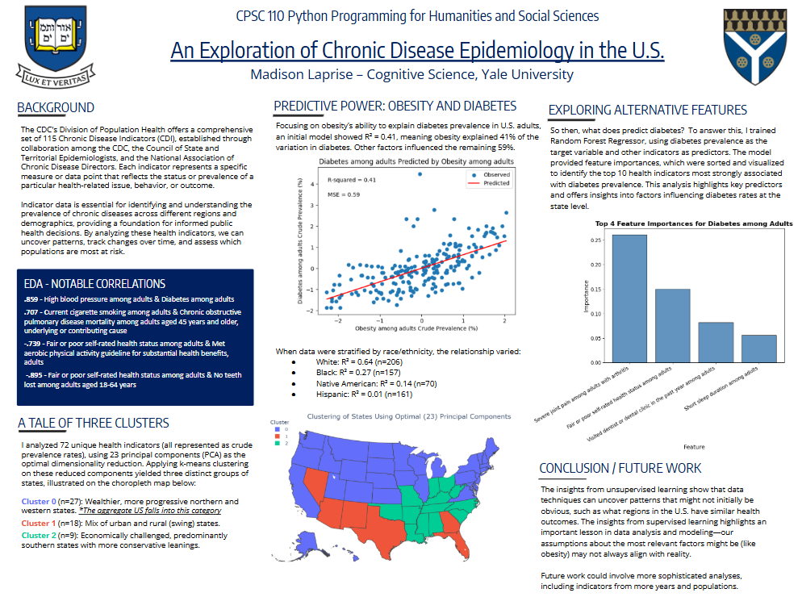

# An Exploration of Chronic Disease Epidemiology in the U.S.
### A CPSC 110 Final Project by Madison Laprise, Yale College ‘25
This study explores diabetes prevalence among adults using chronic disease indicators from U.S. state-level data. After filtering, preprocessing, and standardizing the dataset, I performed predictive modeling to examine the relationship between obesity and diabetes. Surprisingly, obesity was not among the top predictors in the feature importance analysis, suggesting that other health indicators, such joint pain, and self-ratings of health. Additionally, principal component analysis (PCA) and clustering were used to group states into three distinct clusters based on health profiles, revealing regional patterns in chronic disease metrics. These findings provide nuanced insights for public health strategies and underscore the complexity of factors driving chronic disease prevalence. For more details, see the project website. 

